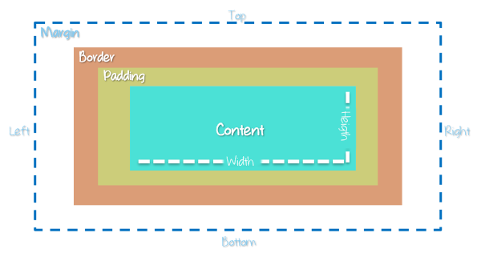

# Modelo de caja

Con HTML y CSS todo se maneja con cajas, comprender su funcionamiento es esencial para el diseño y maquetado. El modelo de caja se compone por:
* Margin
* Border
* Padding
* Content

### Margin
Es el área fuera del borde, externa al elemento.

### Border
Es el borde que rodea el elemento, podría decirse que es la frontera entre el elemento y el resto del contenido.

### Padding
Deja un espacio dentro del elemento, alrededor del contenido.

### Content
Es donde se encuentra el contenido del elemento (textos, imágenes, videos, etc.)

***
| Anterior                   | Siguiente                     |
|----------------------------|-------------------------------|
| [Pseudo elementos](/pseudos/) | [Especificidad](/especificidad/)|