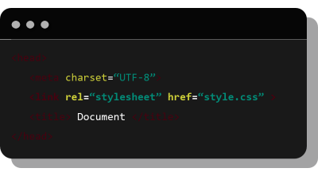
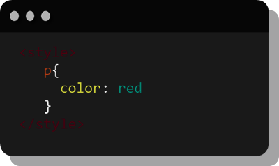
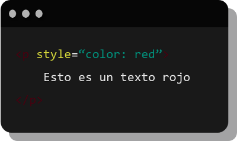
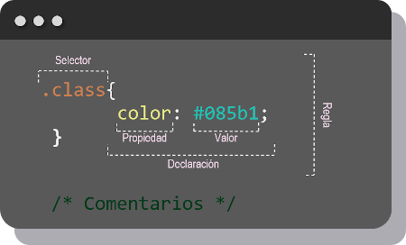

# ¿Cómo agregar CSS a un proyecto?

Existen tres maneras de agregar css a un proyecto en html 
* CSS externo
* CSS interno
* CSS en linea

### CSS externo 
Usando una etiqueta `<link>` se hace referencia al archivo de estilos (.css) pasando la ubicación de este como parámetro del atributo `href`.

### CSS interno
Se definen las instrucciones css dentro de una etiqueta `<style>` en el documento HTML.

### CSS en linea
Se define el estilo como atributo del parametro `style=` en el elemento al que se le quiere aplicar.

&nbsp;
&nbsp;
# Estructura de CSS

| Anterior                   | Siguiente                     |
|----------------------------|-------------------------------|
| [¿Qué es CSS?](./) | [Selectores](/selectores/)|
