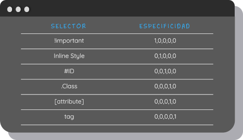

# Control de orden

Los estilos en CSS tienen un orden y una importancia en la que se asignan a los diferentes elementos.

**1** Importancia
**2** Especificidad
**3** Orden de las fuentes

Si dos declaraciones tienen la misma importancia, la especificidad de las reglas decidirá cúal se debe aplicar. Si las reglas tienen la misma especificidad, el orden de las fuented controla el resultado final.

### Importancia

El navegdor principalmente agrega la hoja de estilo de agente de usuario, que es el estilo pordefecto y propio del navegador.  

Luego se agregan nuestros estilos, las reglas de CSS que nosotros hayamos definido.

Por ultimo aplica los estilos importantes (Que estén marcados con un **_*!important*_** ).

### Especificidad

La especificidad es la manera mediante la cual los navegadores deciden qué valores de una propiedad CSS son más relevantes para un elemento y, por lo tanto, serán aplicados.

### Orden de las fuentes

Cómo ya se ha mencionado antes CSS son hojas de estilo en cascada, esto quiere decir que los estilos se aplicaran de arrriba hacia abajo.

***

| Anterior                   | Siguiente                     |
|----------------------------|-------------------------------|
| [Modelo de caja](/boxmodel/) | [Herencia](/herencia/)|