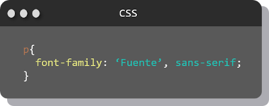

#Fuentes
Las tipografÍas son una parte importante en el diseño y estilo que agregamos a una página web por ende tambien son parte esencial de  CSS.

Tenemos tres maneras de cambiar la tipografía usando CSS.

* Fuentes genéricas
* Fuentes externas
* Fuentes personalizadas

### Fuentes genéricas
Son las fuentes que están instaladas por defecto en los navegadores. Tenemos cuatro familias de fuentes genéricas.

### Fuentes externas
Una de las maneras de agregar fuentes distintas a las genéricas es haciendo uso de fuentes externas, estas pueden ser obtenidas de distintos sitios, uno de los más populares es [Google Fonts](https://fonts.google.com).

Para poder hacer uso de estas fuentes debemos hacer referencia de enlace a través de una etiqueta `<link>` en nuestro HTML.

Para aplicarla usamos la propiedad de CSS `font-family` a la cual se le asigna la fuente y su familia.

### Fuentes personalizadas
Otra forma de aplicar fuentes que no sean las genéricas es haciendo uso de las fuentes personalizadas (fuentes embebidas), esto lo hacemos poniendo los archivos de las fuentes directamente en nuestro proyecto, y para usarla llamamos a la propiedad `@font-face` donde principalmente vamos a darle un nombre a la familia de la fuente `font-family` y ha ramos refeencia a la ubicación de nuestro archivo.ttf.

## Propiedades de las fuentes
|Propiedad|Descripción|
|---------|-----------|
|font-family|Especifica la familia de fuentes en el texto|
|font-size|Especifica el tamaño de la fuente|
|font-style|Especifica el estilo de la fuente del texto|
|font-variant|Muestra el texto en mayúsculas o en fuente normal|
|font-weight|Especifica el grosor de las fuentes|

***
| Anterior                   | Siguiente                     |
|----------------------------|-------------------------------|
| [Variables](/variables/) | [Display](/display/)|