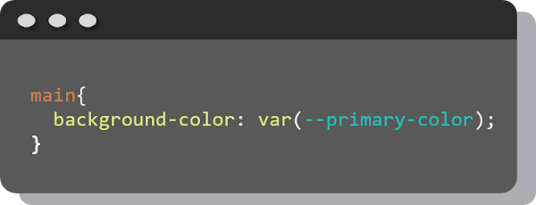

# Variables

Las variables en CSS sirven para declarar estilos que se repiten constantemente y facilitar el trabajo en ciertas ocasiones. Además, en las variables de CSS puede ser modificado su valor desde JavaScript.
Una buena forma de utilizar estas variables es en el uso de los colores. En lugar de copiar y pegar los mismos colores varias veces se pueden usar las variables.

### Cómo se crean las variables en CSS
Las variables deben declararse dentro de un selector. Se acostumbra usar `:root` para que la variable sea global, se declaran con dos guiones y el nombre.

### Cómo utilizar las variables de CSS
Para utilizar las variables se usa una función de CSS `var()` la cual lleva como parámetro el nombre de la función.

En este caso todo el `<main>` tendrá como fondo el color asignado a la variable.

***
| Anterior                   | Siguiente                     |
|----------------------------|-------------------------------|
| [Medidas](/medidas/) | [Fuentes](/fuentes/)|